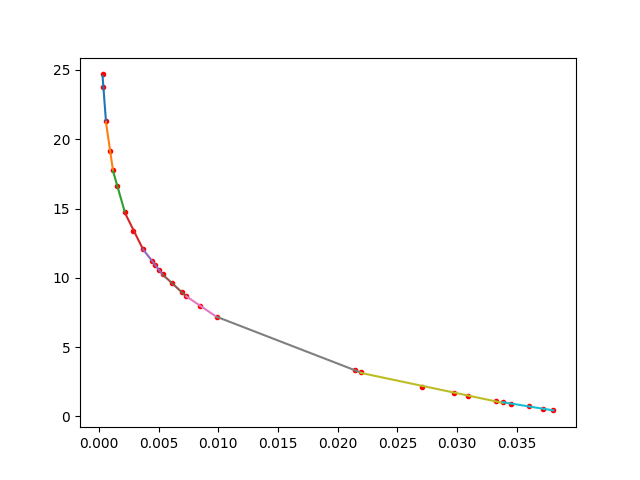
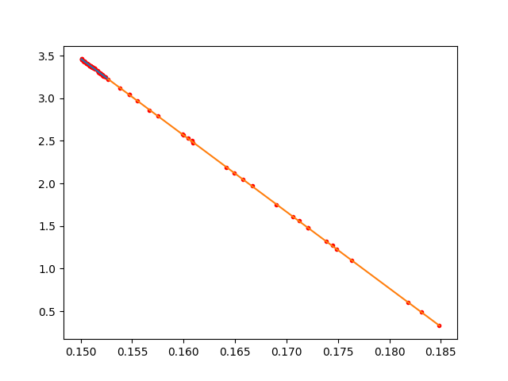
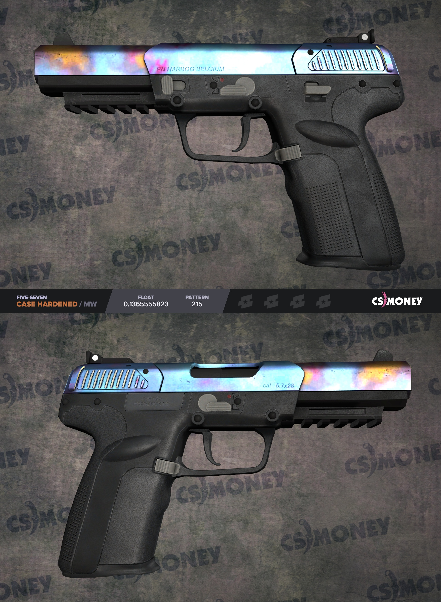

ОПАСНО! - код ну просто нереально плохой и нечитабельный, но.. Некоторые вещи очень полезные ($$$) и крутые (tradeUp, RareITEMSAnalytics, bluePatterns).

ALERT! - ultra-super unreadable code, but.. Some projects are very useful ($$$) and interesting (tradeUp, RareITEMSAnalytics, bluePatterns).

# steamSkins
*scripts to automate steam trades between different platforms and for analyzing some kind of stuff.

*скрипты для автоматизации обмена в стиме и анализа всяких всячин.

{RU}
*Все это используется и использовалось исключительно в образовательных целях!*

*Я никак не правил код перед публикацией, лишь удалли все куски кода, относящиеся ко мне или базе данных.*

Весь этот проект был практически моим первым опытом в программировании, поэтому код может (точно будет) непонятным и кривым (что поделаешь :D)/
Данные скрипты (практически все) когда-то были рабочими версиями и активно использовались. Я перешел в иную сферу и более не поддерживаю этот проект.
Изучите код и скорректируйте его под себя, а только потом запускайте, удачи (она вам понадобится)!

-- *обращаю внимание, что весь материал этого репозитория находится под лицензиец MIT.*

{EN}
*Scripts were used for educational purposes only.*

*I did not adapt the code for publication, I just deleted all the pieces of code that related to the database or to me.*

*My dear ENg bros, unfortunately all the comments in the code are in Russian*

I've started my coding journey with this project, so the code might be unreadable and terrible sometimes (unfortunately ;D)
Almost all scripts some time ago used to solve some kind of problems and be very useful for me. I moved to another area and no longer need this project.
Сheck the code first and adjust it for your needs, don't run it mindlessly. wish u luck (you will definitely need it)!

-- *note that the whole repository is under the MIT license*

## tradeUP
{RU} - Самый сложный и конченый проект из всех тут представленных. Тут даже у меня нет шансов, разобрать что-то практически невозможно, но это, пожалуй, самый интересный и крутой проект. Суть простая: флоат предметов из контракта можно определить со 100% точностью (да-да), мы находим крутые комбинации этих контрактов под разные платформы. Сколько же ночей я не спал, пока делал вот ЭТО.

{EN} - The most difficult project in this repository, but not as difficult as interesting one(even I can't figure it out). We can calculate with the 100% accuracxy the float of an outcome item from contract (it opens up some space for the imagination), so we find some cool connections between items on different platforms.

подробнее / details [tradeUP](tradeUP)

## ScriptsForDiffPlatforms
{RU} - Тут основной набор скриптов, которые помогут вам в автоматизации на разных платформах

{EN} - The main set of scripts for automating tasks on different platforms

подробнее / details [ScriptsForDiffPlatforms](ScriptsForDiffPlatforms)

## RareItemsAnalitycs
{RU} - Тут я получал практически стопроцентную точность у большинства предметов по определению переплаты за флоат на сайте csmoney. Также тут есть парсеры одноименного сайта (стикеров и флоата). Писалась модель по определению переплаты за стикеры, но её точгность оставляет желать лучшего, возможно кто-то это исправит.

{EN} - Get almost 100% accuracy on predicting float overprice (csmoney). Here we have some parsers (float and stickers) for csmoney as well. I tried to build a model for predicting stickers overprice for csmoney, but it is shitty anyway (probably someone will solve this problem).
подробнее / details [RareItemsAnalitycs](RareItemsAnalitycs)

## bluePatterns
{RU} - У некоторых оружий в игре очень ценится количество синего цвета, так этот проект был сделан для определения редкий пушек.

{EN} - Some kind of weapons valued at a higher price due to the amount of blue they are covered with.

подробнее / details [bluePatterns](bluePatterns)

